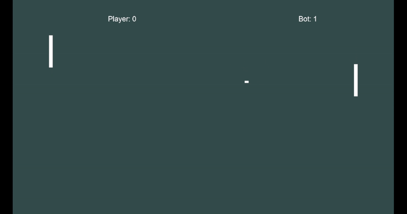

# PonGL: "Simple" Pong implementation with OpenGL and C++

## Description
This is an OpenGL project that uses Git submodules.  
This project contains the following libraries:
- GLFW
- GLM
- GLAD
- Assimp
- Stb_image
- FreeType

This project was built in VSCode using CMake. See how to use CMake with VSCode [**here**](https://github.com/microsoft/vscode-cmake-tools/blob/main/docs/README.md).

You can use this project as some kind of "template" for your own project. Delete all files in [**src**](src) except [**main.cpp**](src/main.cpp) and [**glad.c**](src/glad.c), and modify the [**CMakeLists.txt**](CMakeLists.txt) file accordingly.

## Output
The executable file is build in the [**build**](build) folder.

## Additional notes
- Assimp and stb_image are not used.  
- MVC Architecture.
- MIT License